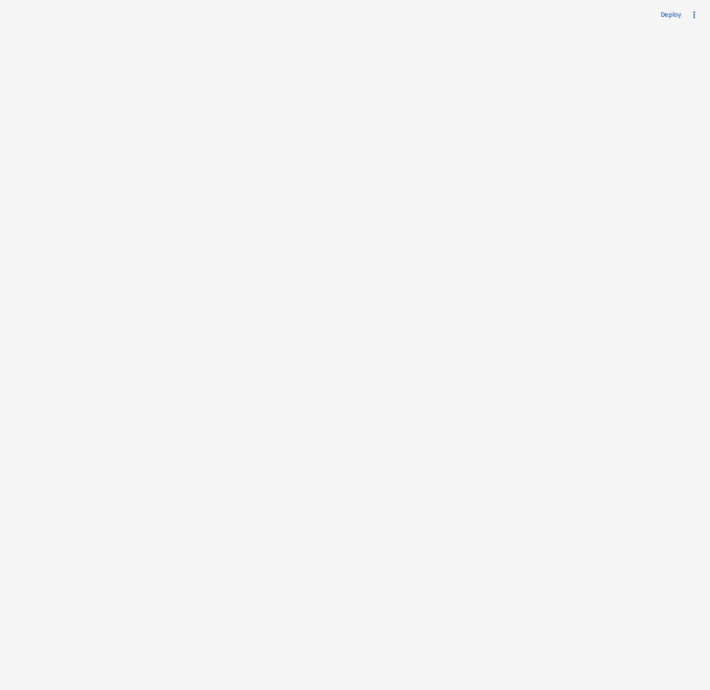

# DocShipper

DocShipper is a post-production utility that turns NLE XML exports into usable paperwork fast.

It parses XML from tools like Premiere, uses the edit as the source of truth, and automates two common deliverables:

- shotlists with source timecodes and screenshots
- music cue sheets with timecodes, metadata, and legal/library fields

Both can be generated separately or together in the same UX flow.

Status: active development, working prototype.



## What It Does

### Shotlist workflow

Uses an XML export plus a reference video file to generate a client-ready shotlist.

- parse clip boundaries directly from Premiere XML for frame-accurate timing
- find cut points from the timeline
- capture screenshots at those edits
- populate source timecodes and screenshots into a client template or custom layout
- support clip name, source in/out, record in/out, duration, and screenshot fields

The generated workbook is saved as `<source_name>_shotlist.xlsx`.

### Cue sheet workflow

Scans the XML for linked audio, then:

- finds referenced music files
- locates their usage in the edit
- extracts embedded metadata from source media
- fills cue-sheet-ready fields for legal and delivery use
- generates a formatted Excel cue sheet automatically

### Combined workflow

If the XML contains both picture and music data, DocShipper can run both workflows in one pass and return separate deliverables from the same session.

## How It Works

1. Upload an NLE XML export.
2. Choose shotlist, cue sheet, or both.
3. For shotlists, add a reference video file.
4. Generate Excel outputs from the parsed timeline and linked media.

## Requirements

- Python 3.9+
- `ffmpeg` and `ffprobe` for screenshot generation and video analysis
- `mediainfo` for music metadata extraction

Python dependencies are listed in `requirements.txt` and include Streamlit, pandas, openpyxl, Pillow, PyMediaInfo, and `defusedxml`.

## Setup

```bash
python -m venv .venv
source .venv/bin/activate
pip install -r requirements.txt
```

Install system packages:

```bash
# macOS
brew install ffmpeg mediainfo

# Ubuntu / Debian
sudo apt install ffmpeg mediainfo
```

## Run Locally

```bash
streamlit run app.py
```

Then open `http://localhost:8501`.

## Typical Usage

### Generate a shotlist

1. Export an XML from the NLE, such as Premiere Pro.
2. Upload the XML on the landing page.
3. Choose `Shotlist`.
4. Upload the matching reference video file.
5. Select either a client Excel template or a custom layout.
6. Review field mapping, set screenshot options, and generate the workbook.

### Generate a cue sheet

1. Upload the NLE XML.
2. Choose `Cue Sheet`.
3. Start processing.
4. Download the generated Excel cue sheet.

### Generate both together

1. Upload the XML.
2. If both video and audio references are detected, choose `Both`.
3. Upload the reference video and configure the shotlist options.
4. Run processing once and download both deliverables.

## Why It’s Useful

- removes manual shot logging from timelines
- speeds up cue-sheet prep for post and legal workflows
- supports client templates without rebuilding spreadsheets by hand
- keeps picture and music paperwork in one simple flow

## Repo Layout

- `app.py`: Streamlit entrypoint, page flow, session state, and workflow orchestration
- `processors/`: parsing, screenshot generation, Excel output, and metadata extraction
- `ui/`: reusable Streamlit components and styling
- `utils/`: shared helpers like timecode conversion and filename sanitization
- `LAUNCH.md`: short local setup notes

## Notes

- The current UI is built around Premiere XML input, even though the backend processor also contains EDL and OTIO parsing support.
- Cue-sheet generation depends on the referenced audio files still being available at the paths stored in the XML.
- There is no automated test suite in the repository yet; validation is currently manual through the Streamlit app.
